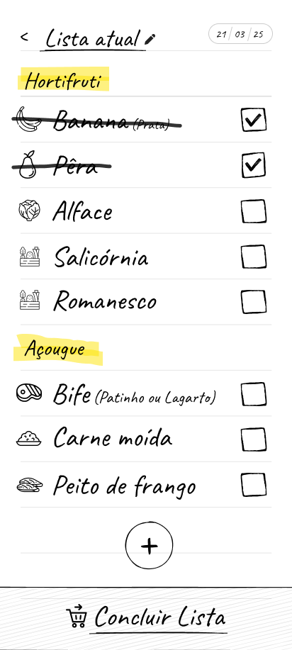
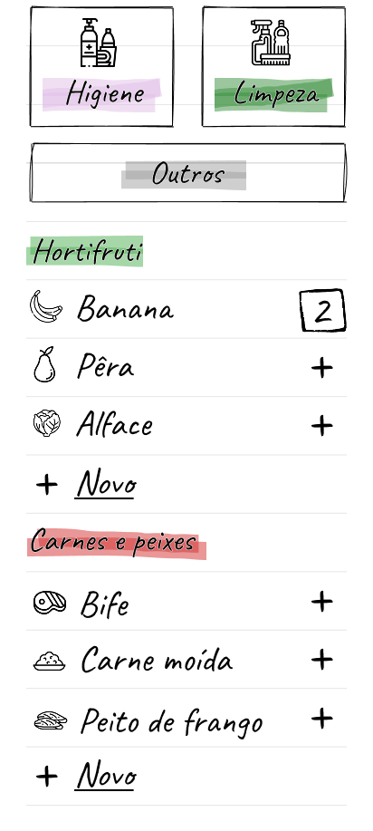

# 🛒 Lista de Compras - App Mobile

Um aplicativo mobile moderno e intuitivo para gerenciar listas de compras.  
Com ele, você pode criar listas, adicionar produtos, marcar como comprados e editar detalhes de forma rápida e prática.

---

## ✨ Funcionalidades
- 📋 **Gerenciar listas**: Crie e visualize suas listas de compras.
- ➕ **Adicionar produtos**: Pesquise e adicione produtos facilmente.
- ✅ **Marcar como comprado**: Controle o que já foi comprado.
- 🏷 **Editar informações**: Renomeie listas e personalize.
- 💾 **Dados salvos**: Suas listas ficam armazenadas de forma persistente.

---

## 📱 Screenshots

<div align="center">
  
  
  
  
  
</div>

---

## 🛠 Tecnologias Utilizadas
- [React Native](https://reactnative.dev/) com [Expo](https://expo.dev/)
- [Expo Router](https://expo.github.io/router/)
- [TypeScript](https://www.typescriptlang.org/)
- [NativeWind](https://www.nativewind.dev/) para estilização com Tailwind no React Native
- [Zustand](https://zustand-demo.pmnd.rs/) para gerenciamento de estado global
- [Reanimated](https://docs.swmansion.com/react-native-reanimated/) para animações fluidas
- [MMKV Storage](https://github.com/mrousavy/react-native-mmkv) para armazenamento local de alta performance
- [FlashList](https://shopify.github.io/flash-list/) para listas performáticas
- [Maestro](https://maestro.mobile.dev/) para testes automatizados de interface
- API REST customizada para gerenciamento de listas e produtos

---

## 🚀 Como Executar
```bash
# Instale as dependências
npm install

# Inicie o projeto no Expo
npx expo start
